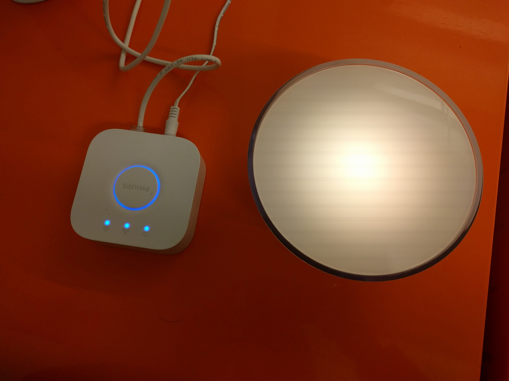

This article is about IOT, DIY and lamps, and a little bit of lean.

[](img/ilovelamp.gif)

So 2 weeks ago we bought some lamps! And since we are a bunch of nerds we bought a bridge to play with them. _I am not going to hide the brand to make this article clearer._

So we had this lamp and this bridge

[](img/hubandlamp.jpg)

After buying it, then we wondered what we could do with it :| #lean.

# We love our clients

Every week, the scrum team of a project asks their client if they are satisfied with 3 questions: 1) How do you feel about the speed of the team? 2) How do you feel about the quality of the collaboration with Theodo? 3) Would you recommend Theodo?

Depending on the answer there are 3 categories:

- KO: red bucket, the client is not satisfied we need to react
- OK: the client satisfaction meets our standard
- Wahou!: the client gave us the perfect grade

We had our idea! We are a lean company, we want indicators. Whenever a client fills the google form, we are going to change the lamp color according to the result :D .

# How do we do this ?

[](img/1xd6ug.jpg)

Here is the plan:

- Configure the lamps in the office
- Expose the API so we can control it from anywhere
- Create a hook on our google form to call the API and thus control the lamp

-- easy --

## Configure your office lamps

1. Plug the lamps
2. Plug the bridge to your router
3. Download the [HUE app](https://play.google.com/store/apps/details?id=com.philips.lighting.hue2&hl=en_GB) to see if everything is connected
4. Play with the lamps because you are a child

## Access the API of the bridge

1. Connect to the same wifi the bridge is on
2. [Go here](https://www.meethue.com/api/nupnp) to get the IP address of your bridge

```json
[
  {
    "id": "skjdhfskdjfhskkjdf",
    "internalipaddress": "192.168.1.107"
  }
]
```

3. We want to play with the API: copy the ip in the url and add `/debug/clip.htm`: mine is http://192.168.1.107/debug/clip.html
4. We need a token to be authenticated: copy the following body in the message body part (but change the name, you are not Sammy)

```json
{ "devicetype": "my_hue_app#nexus Sammy" }
```

5. Click post - it will say there is an error because you need to press the button of the bridge before getting an access, so click on the button of the bridge and click post again
6. You now have a Token! (if you had trouble having a token read [this](https://developers.meethue.com/documentation/getting-started)).

We can now turn the light on and off! Or change its color more fun. [Here is the doc](https://developers.meethue.com/documentation/core-concepts).

What we will use is this request:

Address http:///api//groups/0/action
Body {"on":true,"bri":255,"sat":255,"hue":12345}
Method PUT

### Change the color when a new form is submitted

Now let's say you have a Google form (create one just for fun).
We are going to put a small Google script to run a function when a new form is submitted.

If you know nothing in Google script it is ok, it is javascript.

[](img/i-know-how-to-do-it.gif)

On the form, click on the menu on the right hand top Select "Script Editor"

And then paste and adapt this code:

```js
function changeLightColors(colorCode) {
  var formData = {
    hue: colorCode
  };

  var options = {
    method: "put",
    payload: JSON.stringify(formData)
  };
  var url = "http://7b581ba2.ngrok.io/api/X4i3vMp9e-EZqOp1-IOiTK5T2HsQEoMfffqa6xSY/groups/1/action";
  UrlFetchApp.fetch(url, options);
}
```

Here is the code we call each time there is a new form submitted

```js
function isNewFormOK(newForm) {
  response = newForm.response.getItemResponses();
  speed = parseInt(response[0].getResponse()[0]);
  colab = parseInt(response[1].getResponse()[0]);
  reco = response[4].getResponse();
  if (speed + colab > 7 && reco === "Yes, absolutely") {
    if (speed + colab === 10) {
      changeLightColors(24173);
    } else {
      changeLightColors(8464);
    }
  } else {
    changeLightColors(65423);
  }
}
```

BUT!
In the `changeColorLight` function we fetch a weird URL. That's right, we need to access our hue bridge from the outside world, while the bridge is only on our local wifi.
One way to do it is openning a http tunnel with Ngrock

# Access the lights from the outside world

## Fix the local ip address of the bridge

DHCP might change the bridge adress every now and then, you don't want that. Look up in google: {{your router model}} assign static IP. Fix the ip address of the bridge.

## Access the bridge from the outside

If like me you don't have a fixed ip address because your internet provider does not want you to! There is a free solution:

- [install beame-instal-ssl](https://github.com/beameio/beame-insta-ssl)
- run `beame-insta-ssl tunnel make --dst 192.168.0.4:80 --proto http` (replace the static ip of your bridge)
- you now see an beame url you can access !

Beame is nice because you get to keep the address even if you relaunch the tunnel.

## Configure an IOT Hub

Now, maybe your computer won't always be on the same wifi than the lights.
First, fix the local IP of your hub so it does not change when you restart your router (look for DHCP reservation + your router brand).
You can run the tunnel on a raspberry pi:

- create a file `launch-tunnel.sh` in the pi directory
- in the file, write: `sudo -u pi /usr/bin/beame-instal-ssl tunnel make --dst 192.168.1.4:80 --proto http > /home/pi/beame.log &` (replace with the local IP of your hub of course)
- in `/etc/rc.local` add `/home/pi/beame-tunnel.sh`
- access the beame url of your tunnel to make sure it works

[](img/iothub.jpg)

## Watch the status of your IOT Hub with a simple HealthCheck

There are many services that provide healthcheck reports.
I chose a simple google script that checks every hours the status of my endpoint.
If the response is 200, do nothing, else send me a mail.
To create a google script:

- Open a new google spread sheet
- tool -> open script editor
- in the script editor copy this code (replace the URLOFIOTHUB and YOUREMAILADDRESSS):

```
  function healthCheck() {
  url = "https://URLOFIOTHUB"
  thereIsAnIssue = false
  try {
  response = UrlFetchApp.fetch(url)
  if(response.getResponseCode() != "200") {
  thereIsAnIssue = true
  issue = "IOT Hub response was not 200 but " + response.getResponseCode()
  }
  } catch(e) {
  thereIsAnIssue = true
  issue = e
  }

      if(thereIsAnIssue) {
        sendIssueMail(issue, url)
      }

  }

  function sendIssueMail(issue, url) {
  message = "There was an isue with the IOT Hub.\n"
  message += "The following url has an issue: " + url + "\n"
  message += "The issue was the following: " + issue + "\n"
  message += "You may try to reboot the IOT Hub, behind the orange fridge."
  Logger.log(message)
  email = {
  to: "YOUREMAILADDRESSS",
  replyTo: "YOUREMAILADDRESSS",
  subject: "IOT Hub is down!",
  htmlBody: message
  }
  MailApp.sendEmail(email);
  }
```

Test the code with a fake url:

- Replace the url by a fake one that should not exist
- in the menu bar select `HealthCheck()` function
- run the function by clicking the little play arrow
- Receive the mail

Automate the check:

- In the script go to Edit -> triggers
- Add a new trigger `healthCheck()` run it hourly (or as you prefer)
- You are done ;) unplug your raspberry pi or kill your tunnel and wait for an email

Alright! You are ready to do awesome stuff! In part 2 of the article I'll show how to plug webhooks of github and CircleCi so you see red lights when your deployment fails :O, see the GIF.

[](img/buildfailgif.gif)
